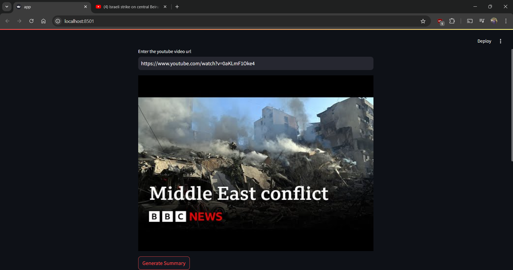

# YouTube Video Summarizer

**Example of this app working:**

**How to run this in your system locally:**
- Clone the repository into your system.
- Open the folder containing the repository files with VS Code.
- If you don't already have python installed then please install python first before continuing
- Make a file with name : .env
- In .env file write : google_api_key = '//here you can paste your own google_api_key to run'
- Open the terminal by pressing "Ctrl and `" if you are on windows.
- Run this command in the terminal    : python3.11 -m venv venv
- The run this command                : pip install -r requirement.txt
- After that to run, use this command : streamlit run app.py
- If the local URL is not automatically opened then paste this in your browser address bar : http://localhost:8501/
- Now to try this, paste the link of any video that is in English in the box on the web page and You will see the submarized text. 

This tool is designed to help you save time by summarizing long YouTube videos into concise and easy-to-read text. By highlighting the key points and important information from the video, you can quickly grasp the main ideas without having to watch the entire video. 

Whether you're a student trying to get through a lengthy lecture, a professional looking to stay updated with industry trends, or just someone who wants to get the gist of a video without spending too much time, this summarizer is perfect for you. 

The YouTube Video Summarizer uses advanced algorithms to analyze the video's content and extract the most relevant information. It then presents this information in a clear and organized manner, making it easy for you to understand and retain the key points. 

With this tool, you can:
- Save time by getting the main ideas of a video quickly.
- Avoid watching long videos in their entirety.
- Focus on the most important information.
- Enhance your learning and retention by reviewing concise summaries.

Try the YouTube Video Summarizer today and make your video-watching experience more efficient and productive!

